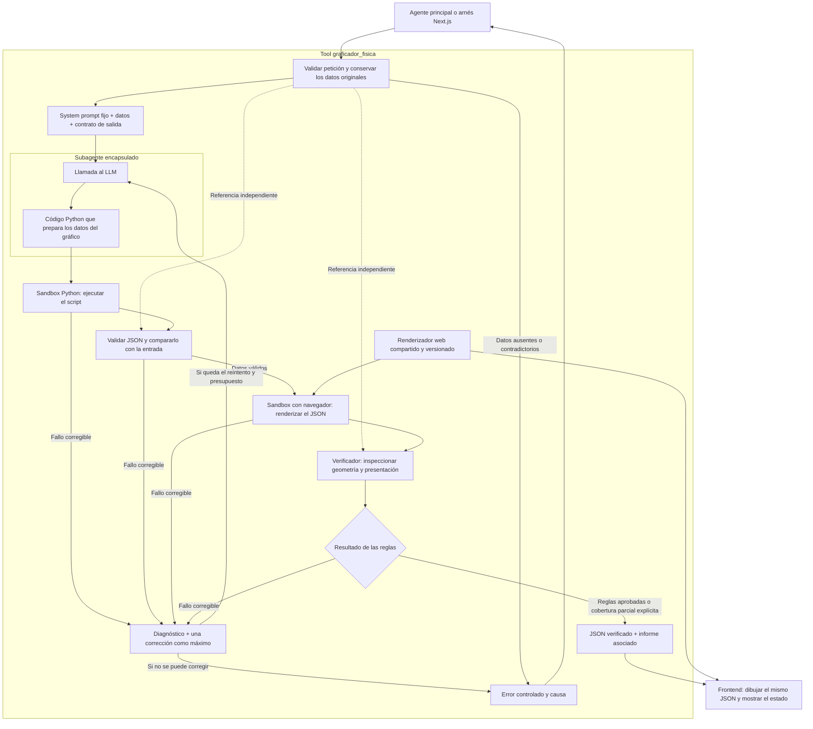

# Tool de gráficos de Física I

Propuesta revisada: JSON como salida y un renderizador web compartido con el frontend. El PNG queda como captura de prueba o descarga opcional. Esta versión reemplaza la propuesta anterior basada en Matplotlib y PNG como salida principal.

La tool representa planteos iniciales y resultados ya calculados; la consulta de libros y la resolución física pertenecen al sistema principal.

## Estructura

## Encapsulamiento y Python generado

El agente general ve una única tool con entrada y salida. El subagente prepara mensajes, llama al LLM y recibe Python. El servidor conserva las credenciales y controla los límites; el sandbox no recibe secretos.

Se mantiene la generación de Python solicitada, pero el script prepara un diccionario serializable a JSON en lugar de una figura de Matplotlib. Debe respetar los datos físicos y conservar las incógnitas.

El JavaScript que dibuja será un componente compartido y mantenido por los implementadores. El JSON contiene datos y propiedades declarativas admitidas por el contrato, sin funciones ni expresiones JavaScript generadas.

## Contrato del grupo

El documento para colaboradores, sección 5.2 (páginas 3-4), define `tipo_grafico`, `ejes`, `series` y `metadata`. El frontend convierte esos datos en gráficos con Chart.js. Este diccionario de intercambio no es directamente la configuración nativa de Chart.js: un adaptador compartido realiza la conversión.

Se conserva ese formato para curvas. El documento enumera `vectores`, pero no desarrolla el contrato geométrico ni el renderizador de escenas. Hay que acordar los datos de cuerpos, superficies, conexiones, puntos de aplicación, vectores, símbolos y convenciones. El ejemplo de series no representa por sí solo todas esas situaciones.

El informe se entrega asociado al gráfico. Su ubicación en la respuesta o transporte se acuerda sin modificar silenciosamente el diccionario esperado por el frontend.

## Renderizado y verificación

1. Ejecutar Python en un entorno aislado y obtener el JSON candidato.
2. Validar estructura, tamaños y valores; compararlo con la copia original de la entrada.
3. Renderizarlo en un navegador del sandbox con el mismo adaptador, código de dibujo, versiones, opciones y fuentes del frontend. Las dependencias están disponibles localmente, sin red ni secretos y con límites de recursos.
4. Inspeccionar los elementos o datos de renderizado soportados, teniendo en cuenta coordenadas y transformaciones. Una captura o un JSON auto-reportado no bastan para demostrar corrección geométrica.
5. Emitir el informe y devolver exactamente el JSON verificado junto con la identificación de la versión del renderizador. No regenerar ni cambiar los datos después de verificarlos.

Las dos etapas de ejecución pueden usar entornos efímeros separados bajo un presupuesto total. El verificador conserva la entrada de referencia fuera del código generado y trata las salidas del sandbox como datos no confiables.

Para la primera versión, se desactivan las animaciones en ambos entornos y se prueban tamaños de pantalla acordados. La aprobación se limita a las reglas y condiciones comprobadas; compartir código no garantiza igualdad de píxeles en todos los dispositivos. Nuevas interacciones requieren las comprobaciones correspondientes.

## Reglas, cobertura y correcciones

La lista de gráficos y ejemplos permite programar reglas reutilizables: correspondencia de series, unidades y ejes; dirección y sentido de vectores; contactos, orientación y conexiones. Se diferencian esquemas simbólicos y dibujos a escala.

Cada regla informa `pasa`, `falla`, `no_aplica` o `no_verificable`. El LLM no decide qué controles omitir.

- **Aprobado:** pasaron todas las reglas requeridas para ese tipo de gráfico y condiciones de renderizado.
- **Parcial:** no se detectaron fallos, pero falta cobertura; el frontend debe mostrar esa limitación.
- **Error:** faltan datos, falla la ejecución o persiste un fallo. Un gráfico fallido no se presenta como aprobado.

Un tipo desconocido o sin reglas suficientes no se aprueba por tener cero fallos. Si tampoco puede renderizarse, se devuelve un error de tipo no soportado.

Hay un intento inicial y una corrección como máximo, dentro del presupuesto total. Los errores de código o representación vuelven al subagente con el diagnóstico; los datos físicos ausentes o contradictorios vuelven al agente principal. Los fallos del proveedor se informan de forma controlada.

## Arnés y entrega

Next.js permite probar la misma tool y mostrar entrada, Python generado, vista web e informe. Python se ejecuta en el sandbox. El arnés, el entorno de verificación y el frontend comparten el renderizador.

El PNG sirve como evidencia visual o descarga opcional. La salida principal es JSON más su informe asociado.
